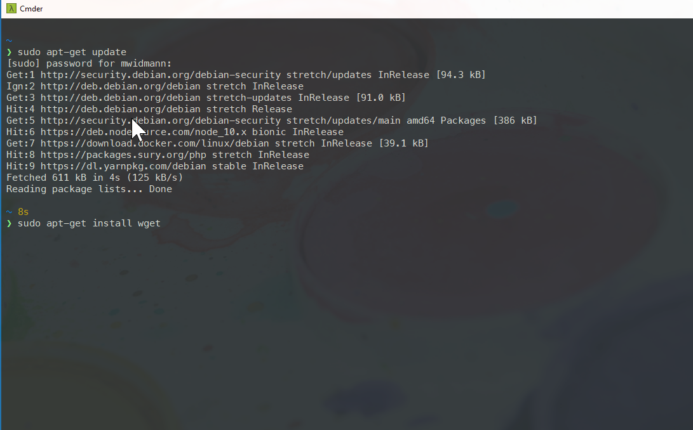

# Post-Mac Web Development with @css[max](Windows 10 and WSL) <small>@VlbgWebDev, 2018/08/14</small>

---?image=assets/img/me.jpg&size=cover&position=center bottom

@snap[north bio]
@css[bio-name](Martin Widmann)
@css[bio-about](Señor Developer @russmedia digital)
@css[bio-byline](@fa[twitter pad-fa] mwidmann)
@snapend

---

## Web Devlopment on Windows? srsly?
@ul[plain]

@ulend
---

## But...

---?image=assets/img/google.gif&size=cover&position=center center

---

## Why macOS for Web Development?

@ul
- Nice to look at hardware making one feel special
  - 10 years ago
- pretty (and) stable operating system
- Good/mostly consistent design language
- Good tools
- BSD core for a very similar environment than on most servers @note[there can be very drastic differences though in the way the commands work]
- [homebrew](https://brew.sh)
@ulend

---

## Why Windows for Web Development?

@ul
- Much wider variety of devices to choose from @note[cheaper and with more features in many cases]
- pretty (and) stable operating system (ymmv)
- Good tools @note[We'll talk alternatives later...]
- Almost all tools are available for Windows as well
- [Chocolatey](https://chocolatey.org/)
@ulend

---

## Differences macOS/Windows

@ul
- Command diffences: `Cmd` vs. `Crtl`
- Path separator: `/` vs. `\`
- Line endings: `lf` vs. `crlf`
- Tools:
  - `ls` vs. `dir`
  - `rm` vs. `del`
  - `cp` vs. `(x)copy`
  - ...
- and then...
@ulend

---
@snap[west]

@snapend

@snap[east small]

@snapend
---
@snap[west small]

@snapend

@snap[east]

@snapend
---

# @css[max](Enter WSL)
(Windows Subsystem for Linux)

---

# Features

@ul
- have access to almost all linux programs (by distribution)
- run windows and linux programs seamlessly @note[there's wslbridge for running linux commands in windows context, paths are converted automatically]
- install various linux distributions in parallel
- use ssh without using putty
- run cron jobs, install network services, do cool stuff
@ulend

---

# Things not so nice in WSL...

@ul
- The difference in paths still remains
- Need to install (and maintain) tools twice @note[windows IDEs rely on windows tools]
- I/O performance is worse @note[can be made better by excluding files/folders in Windows Defender]
- git on windows/wsl can make your life hell @note[need to force eol to lf and filemode to false]
- files in WSL filesystem can't be edited with Windows tools
@ulend

---

# Installation

@ul
- enable WSL feature in Windows 10
- choose distribution of choice in Windows Store @note[ubuntu 18.04, debian Strech, Suse Leap or Enterprise, Kali Linux]
- run installed distro to finish the installation
@ulend

---

# My Setup

@ul
- Server environment running in Docker for Windows
- Services composed through docker-compose
- A mix of Visual Studio Code and PhpStorm
  - with VIM extensions @note[driving me crazy sometimes]
- debian as the primary WSL distro, Ubuntu 18.04 alongside it
- zsh with prezto and pure theme @note[because of async git polling which makes it snappy even in large repositories]
- git mostly in Shell @note[but once the issues with line ends and filemodes, gui can be used as well]
@ulend

Note:
- mainly develop in php, javascript
- Webserver still Apache with mod_php for easier maintenance
- CLI tools installed in Docker accessing the windows installation through the API
- Trusted self signed certificates with minica for local PWA development

---

# Alternative Programs on Windows

---
@snap[north comparison-title]
Terminal
@snapend

@snap[west comparison]
 
  iTerm2
@snapend

@snap[east comparison]

 
[cmder](http://cmder.net) 
<small>Alternative Hyper, [hyper.is](https://hyper.is)</small>
@snapend
---

## Install zsh and prezto
