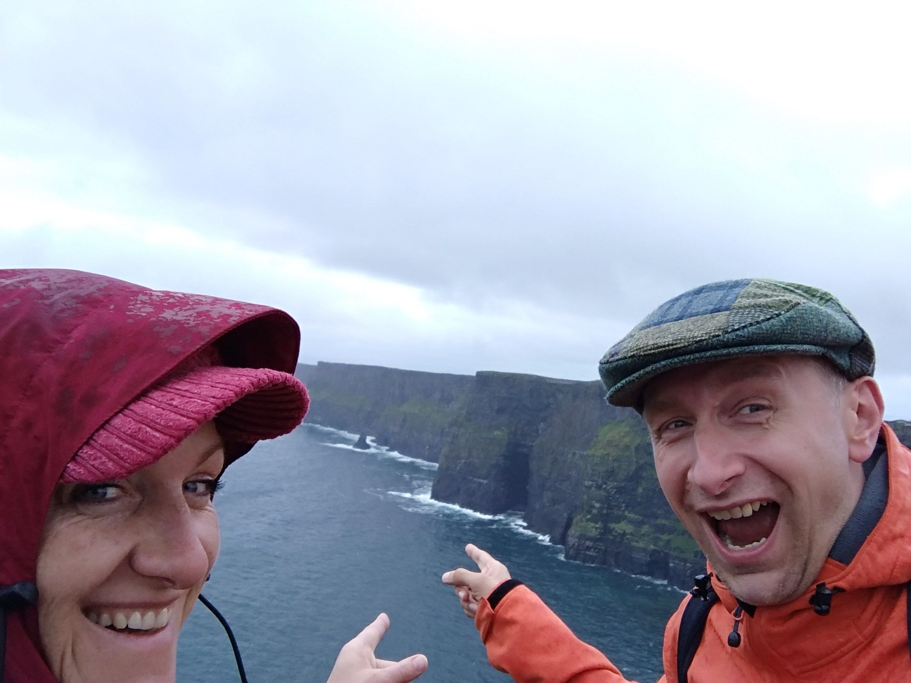

# Post-Mac Web Development with @css[max](Windows 10 and WSL) <small>@VlbgWebDev, 2018/08/14</small>

---?color=black

@snap[west]
@css[bio-about](Señor Developer @russmedia digital)
   
@fa[terminal fa-3x bio-fa](shell lover)
   
@css[bio-about](Italiani all'estero club member)
@snapend

@snap[east bio]
@css[bio-headline](Martin Widmann)
 
@css[bio-byline](@fa[twitter pad-fa] mwidmann)
 

@snapend

---

### Windows? srsly?

---

### But... Windows... sucks?!

---
