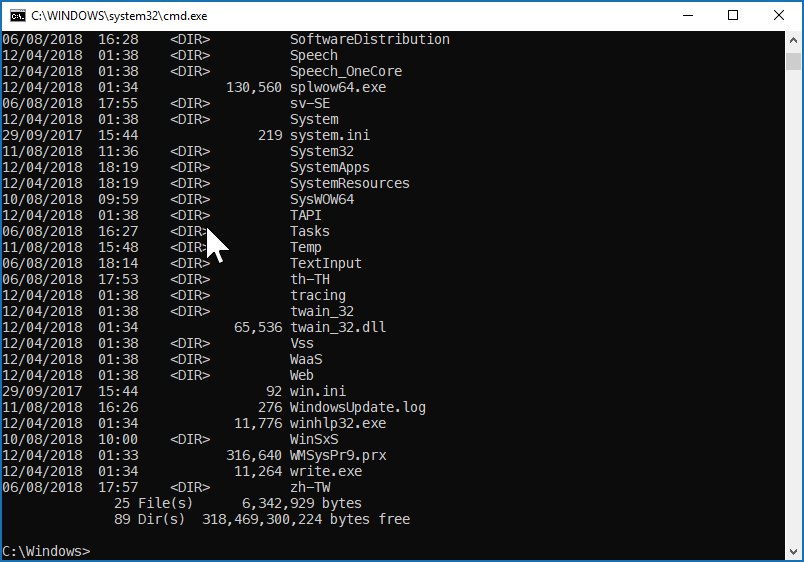
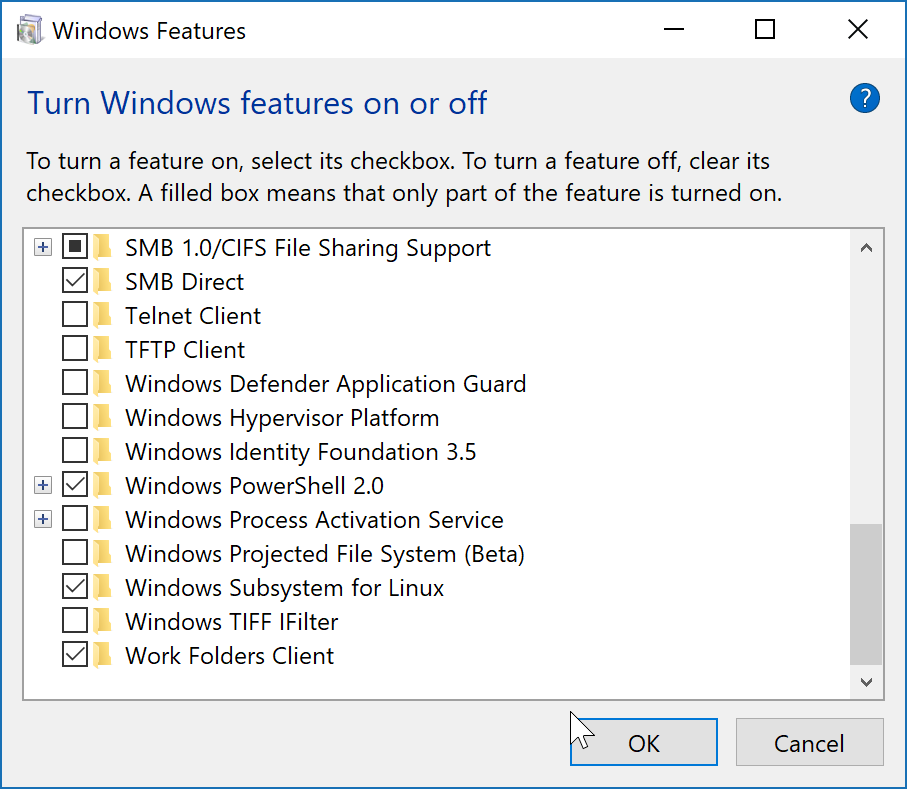

# Post-Mac Web Development with @css[max](Windows 10 and WSL) <small>@VlbgWebDev, 2018/08/14</small>

---?image=assets/img/me.jpg&size=cover&position=center bottom

@snap[north bio]
@css[bio-name](Martin Widmann)
@css[bio-about](Señor Developer @russmedia digital)
@css[bio-byline](@fa[twitter pad-fa] mwidmann)
@snapend

---

## Web Devlopment on Windows? srsly?

---

## But...

---?image=assets/img/google.gif&size=cover&position=center center

---

## Why macOS for Web Development?

@ul
- Nice to look at hardware making one feel special
  - 10 years age
- pretty (and) stable operating system
- Good/mostly consistent design language
- Good tools
- BSD core for a very similar environment than on the servers running Linux
  - which sometime is pretty different
- homebrew
@ulend

---
## Differences macOS/Windows

@ul
- Command diffences: `Cmd` vs. `Crtl`
- Path separator: `/` vs. `\`
- Line endings: `lf` vs. `crlf`
- Tools:
  - `ls` vs. `dir`
  - `rm` vs. `del`
  - `cp` vs. `(x)copy`
  - ...
- and then...
@ulend

---
@snap[west]

@snapend

@snap[east small]

@snapend
---
@snap[west small]

@snapend

@snap[east]

@snapend
---

# @css[max](Enter WSL)
(Windows Subsystem for Linux)

---

# Installation

- enable WSL feature in Windows 10

---

# Installation

- enable WSL feature in Windows 10
- choose distribution of choice in Windows Store 
(.wsl-dist)
(.wsl-dist)
(.wsl-dist)
(.wsl-dist)
(.wsl-dist)
